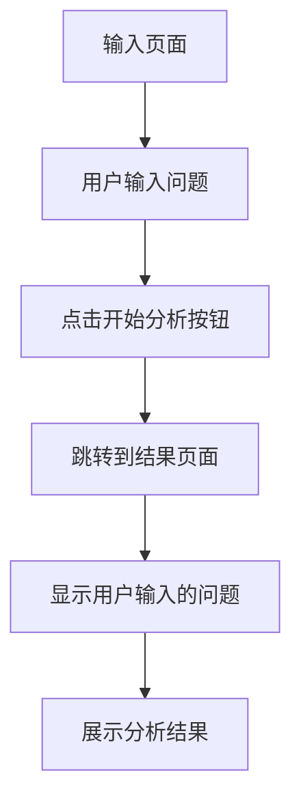

## 1. Product Overview
问题认知分析器是一个帮助用户分析问题的前端工具，通过输入问题并获得结构化的分析结果。
- 主要功能是帮助用户更清晰地理解问题的各个方面，包括表层问题、隐含假设、信息缺失、认知盲点和建议。
- 目标用户是需要进行问题分析的个人或专业人士，无需登录即可使用。

## 2. Core Features

### 2.1 User Roles (if applicable)
| Role | Registration Method | Core Permissions |
|------|---------------------|------------------|
| 普通用户 | 无需注册 | 使用所有功能 |

### 2.2 Feature Module
1. **输入页面**：标题、问题输入框、分析按钮
2. **结果页面**：显示输入问题、分析结果区域

### 2.3 Page Details
| Page Name | Module Name | Feature description |
|-----------|-------------|---------------------|
| 输入页面 | 标题 | 显示"问题认知分析器"标题 |
| 输入页面 | 问题输入框 | 提供textarea让用户输入问题 |
| 输入页面 | 分析按钮 | 点击后跳转到结果页面并传递输入内容 |
| 结果页面 | 问题显示 | 显示用户输入的原始问题 |
| 结果页面 | 分析结果区域 | 展示结构化的分析结果，包括表层问题、隐含假设、信息缺失、认知盲点和建议 |

## 3. Core Process
用户在输入页面输入问题，点击"开始分析"按钮后，系统将用户输入的问题传递到结果页面，并在结果页面展示分析结果。

## 4. User Interface Design
### 4.1 Design Style
- 主色调：蓝色系 (#3B82F6) 和中性色 (#F3F4F6)
- 按钮样式：圆角矩形，轻微的阴影效果
- 字体：系统默认无衬线字体，标题使用较大字号
- 布局风格：简洁的卡片式布局，充足的留白
- 图标风格：简约线条图标

### 4.2 Page Design Overview
| Page Name | Module Name | UI Elements |
|-----------|-------------|-------------|
| 输入页面 | 标题 | 居中大标题，使用主色调 |
| 输入页面 | 问题输入框 | 宽屏textarea，有占位符提示 |
| 输入页面 | 分析按钮 | 主色调填充，白色文字，悬停效果 |
| 结果页面 | 问题显示 | 卡片式展示，浅色背景，边框 |
| 结果页面 | 分析结果区域 | 结构化卡片，每个分析项有标题和内容 |

### 4.3 Responsiveness
- 采用桌面优先设计，同时兼容移动设备
- 在小屏幕上自动调整布局，确保内容清晰可读
- 触摸设备优化，按钮大小适合手指点击

### 4.4 3D Scene Guidance (if applicable)
- 不适用
