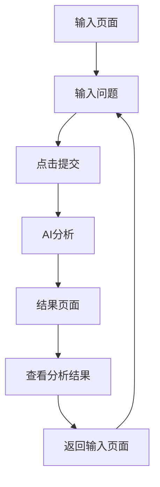

## 1. Product Overview
问题认知拆解工具是一个帮助用户结构化分析问题的网页应用，通过AI分析将复杂问题拆解为多个维度。
- 主要目的是帮助用户更清晰地理解问题本质，识别隐含假设和认知盲点，而不是直接提供解决方案。
- 目标用户包括需要深度思考的专业人士、学生和任何希望提高问题分析能力的个人。

## 2. Core Features

### 2.1 User Roles (if applicable)
| Role | Registration Method | Core Permissions |
|------|---------------------|------------------|
| 普通用户 | 无需注册 | 输入问题并获取分析结果 |

### 2.2 Feature Module
1. **输入页面**: 问题输入区域、提交按钮
2. **结果页面**: AI分析结果展示（分卡片形式）

### 2.3 Page Details
| Page Name | Module Name | Feature description |
|-----------|-------------|---------------------|
| 输入页面 | 问题输入区 | 提供文本框让用户输入问题，支持多行文本输入 |
| 输入页面 | 提交按钮 | 点击后将问题发送给AI进行分析，并跳转到结果页面 |
| 结果页面 | 分析结果卡片 | 展示AI分析的五个维度：表层问题、隐含假设、信息缺失、认知盲点、更好的问题表达 |
| 结果页面 | 返回按钮 | 允许用户返回输入页面重新输入问题 |

## 3. Core Process
用户流程：
1. 用户访问应用，看到输入页面
2. 在文本框中输入需要分析的问题
3. 点击提交按钮
4. 系统将问题发送给AI进行分析
5. 分析完成后，用户被引导到结果页面
6. 在结果页面查看结构化分析结果
7. 可选择返回输入页面重新分析其他问题

## 4. User Interface Design
### 4.1 Design Style
- 主色调：深蓝色 (#1a365d) 和浅灰色 (#f7fafc)
- 强调色：浅蓝色 (#63b3ed)
- 按钮样式：圆角矩形，悬停效果
- 字体：无衬线字体，主标题 20px，正文 16px
- 布局风格：简洁卡片式布局，充足的留白
- 图标风格：简约线条图标

### 4.2 Page Design Overview
| Page Name | Module Name | UI Elements |
|-----------|-------------|-------------|
| 输入页面 | 问题输入区 | 大型文本输入框，支持多行输入，带有占位文本提示 |
| 输入页面 | 提交按钮 | 醒目位置的蓝色按钮，带有加载状态指示 |
| 结果页面 | 分析结果卡片 | 五个独立卡片，每个卡片包含一个分析维度，卡片有轻微的阴影和悬停效果 |
| 结果页面 | 返回按钮 | 顶部导航栏中的返回链接 |

### 4.3 Responsiveness
- 设计采用桌面优先原则，同时支持移动设备自适应
- 在移动设备上，卡片将垂直堆叠排列
- 文本输入区域在移动设备上会自动调整高度
- 触摸优化：按钮尺寸适合触摸操作

### 4.4 3D Scene Guidance (if applicable)
- 不适用，本产品为纯2D界面应用