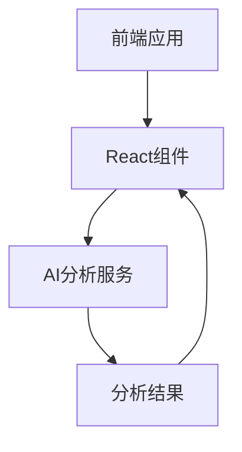

## 1. Architecture Design


## 2. Technology Description
- 前端: React@18 + TypeScript + Tailwind CSS + Vite
- 初始化工具: vite-init
- 后端: 无（使用前端直接调用AI API）
- 数据存储: 无（无需持久化存储）

## 3. Route Definitions
| Route | Purpose |
|-------|---------|
| / | 输入页面，用于输入问题 |
| /result | 结果页面，用于展示AI分析结果 |

## 4. API Definitions (if backend exists)
由于本应用不使用后端服务器，而是直接在前端调用AI API，因此API定义如下：

### 4.1 AI分析API
- **请求方法**: POST
- **请求URL**: 模拟API（实际实现中需要替换为真实的AI服务API）
- **请求体**: `{ "question": string }`
- **响应体**: 
  ```typescript
  {
    surfaceIssue: string;
    implicitAssumptions: string[];
    missingInformation: string[];
    cognitiveBlindSpots: string[];
    betterQuestion: string;
  }
  ```

## 5. Server Architecture Diagram (if backend exists)
不适用，本应用为纯前端应用，无后端服务器。

## 6. Data Model (if applicable)
不适用，本应用无需数据持久化存储。