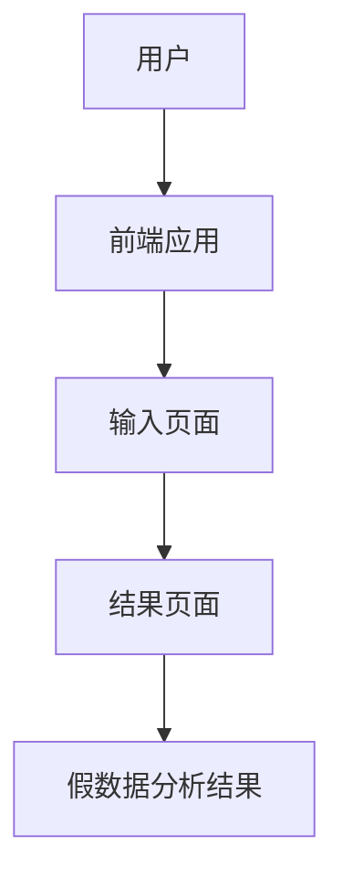

## 1. Architecture Design

## 2. Technology Description
- Frontend: React@18 + tailwindcss@3 + vite
- Initialization Tool: vite-init
- Backend: None
- Database: None

## 3. Route Definitions
| Route | Purpose |
|-------|---------|
| / | 输入页面，用户输入问题 |
| /result | 结果页面，展示分析结果 |

## 4. API Definitions (if backend exists)
- 不适用

## 5. Server Architecture Diagram (if backend exists)
- 不适用

## 6. Data Model (if applicable)
- 不适用
